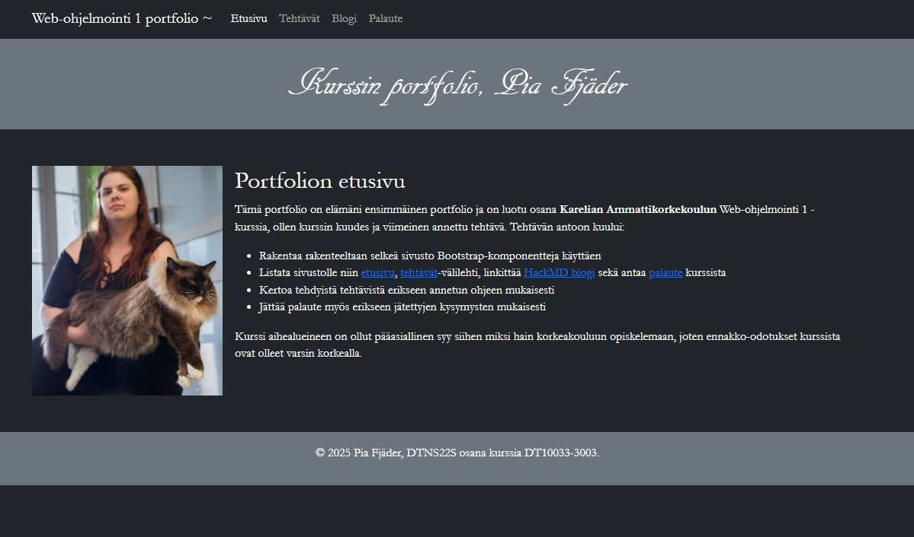
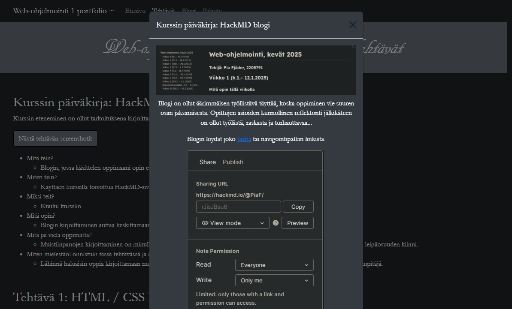
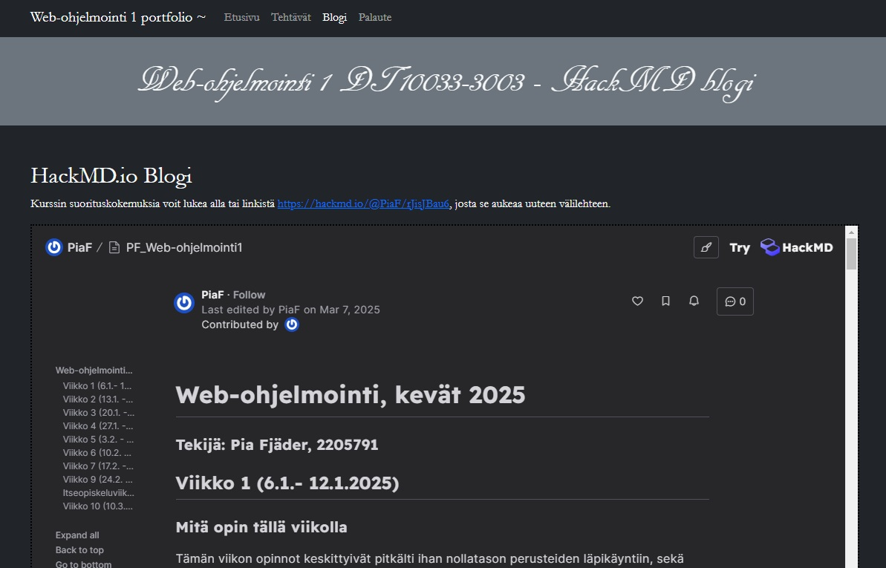

# Web Ohjelmointi 1
## PF_Portfolio

**Course:** Web Ohjelmointi 1  
**Year:** 2025  
**Technologies used:** HTML, CSS (self specified and Bootstrap)
**Tools used:** VS Code , Paint, Snipping tool, Notepad++, Google Chrome
**Language:** Finnish  

## Project description
This was the final assignment of the Web Ohjelmointi 1 course.  
The goal was to create a portfolio that included:
- Course feedback
- A written blog showing the study process throughout the course (embedded directly into the portfolio)

The assignment had several requirements, such as using Bootstrap as the base styling framework and including specific answers in the "tasks" tab.  
I chose to give my portfolio a more personalized and darker look with a font of my choice, aiming for a clear and easy-to-navigate UI.

## How to run
1. Download or clone this project from GitHub.
3. Open `index.html` from the main folder in your browser.
4. Browse along the tabs to see the entirety of the portfolio.
> **Note:** The custom font for the title may not work correctly in all browsers.

## Screenshots
Here are some examples of how the page is supposed to look like:  

## What I learned
- How to create a personalized page with Bootstrap.
- How to create modals using Bootstrap.
- How to embed a HackMD blog into an 'iframe'.
- How to organize content into multiple 'div' elements for a clear layout.