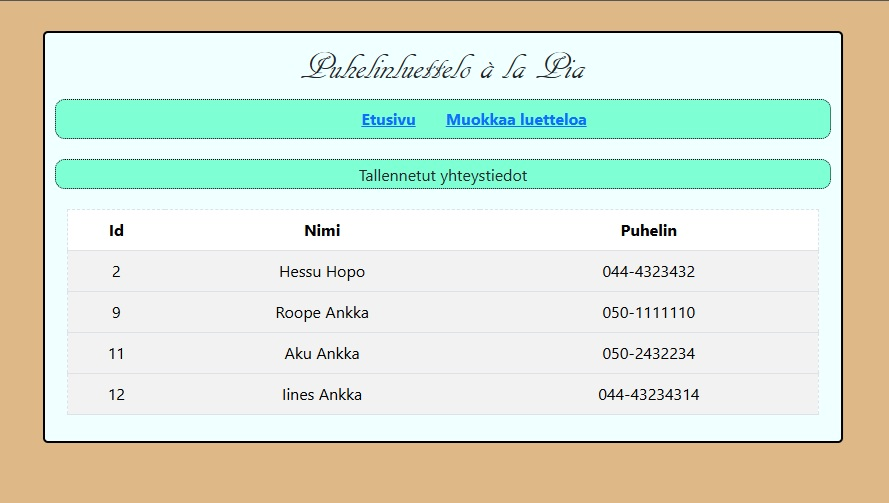
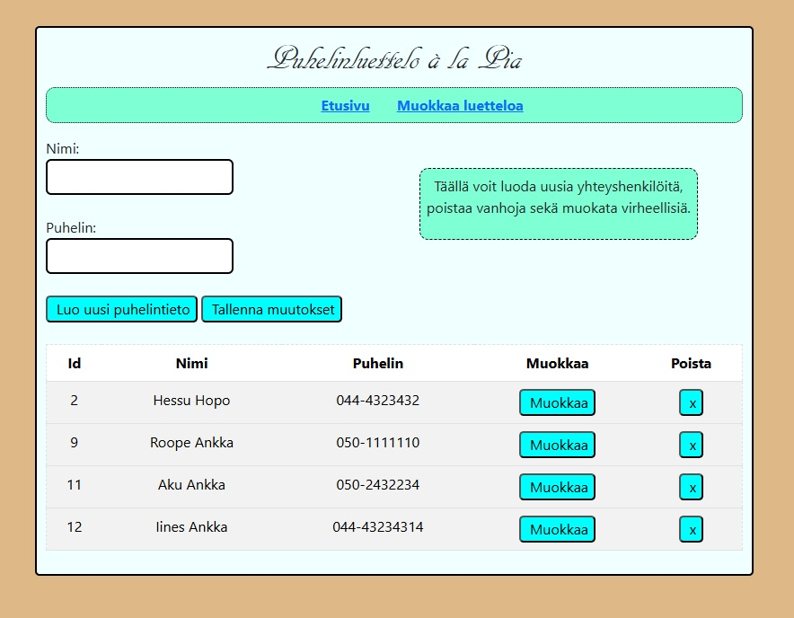

# Web Ohjelmointi 1
## PF_T6_puhluettelo

**Course:** Web Ohjelmointi 1  
**Year:** 2025  
**Technologies used:** HTML, CSS, JavaScript, Bootstrap  
**Tools used:** VS Code  
**Language:** Finnish  

## Project description
This project was created as part of the Web Ohjelmointi 1 course.  
The task involved building a simple phonebook webpage that connects to a teacher-provided server.  
The application allows the user to:
- View a list of saved names and phone numbers.
- Add new entries.
- Edit and delete entries.

## How to run
1. Download or clone this project from GitHub.
2. Ensure that the teacher-provided server is running locally (instructions for installation and startup are located in "server" folder, file named "asennus_ja_kaynnistys.txt", guidance is in Finnish).
3. Open `index.html` from the client folder in your browser.
4. Use the interface to view and manage phonebook entries.
> **Note:** that without the server in the background you can not add, edit, delete or browse the files.

## Screenshots
Here are examples of how the page is supposed to look like:  

## What I learned
- How to create and handle HTML forms with input fields.
- How to organize content into multiple 'div' elements for a clear layout.
- How to create a content specific styles, like hover effects.
- How to style a web page using Bootstrap components.
